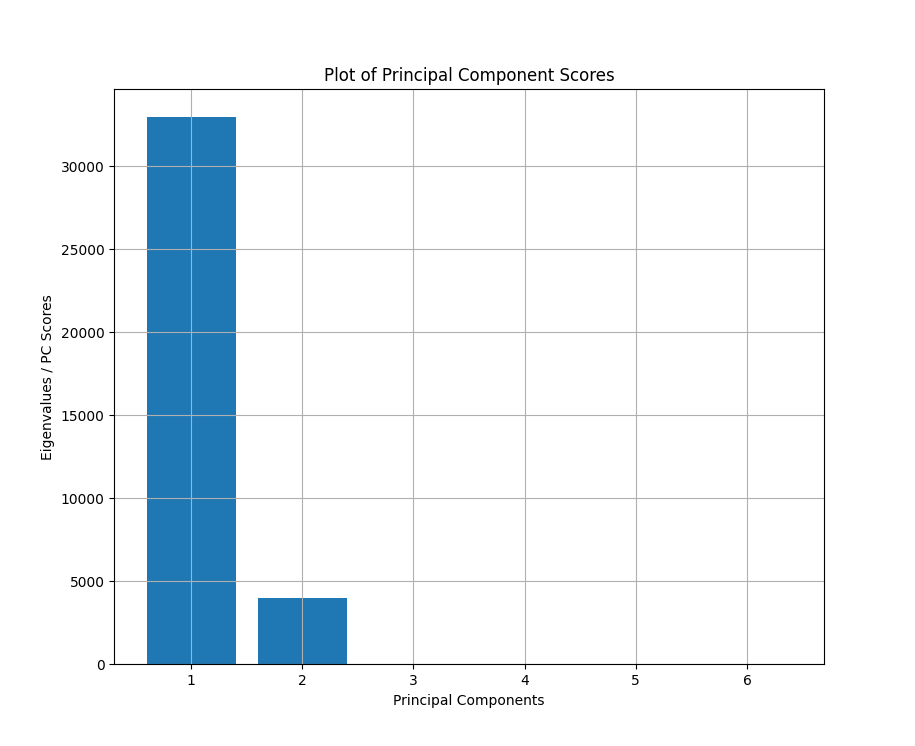
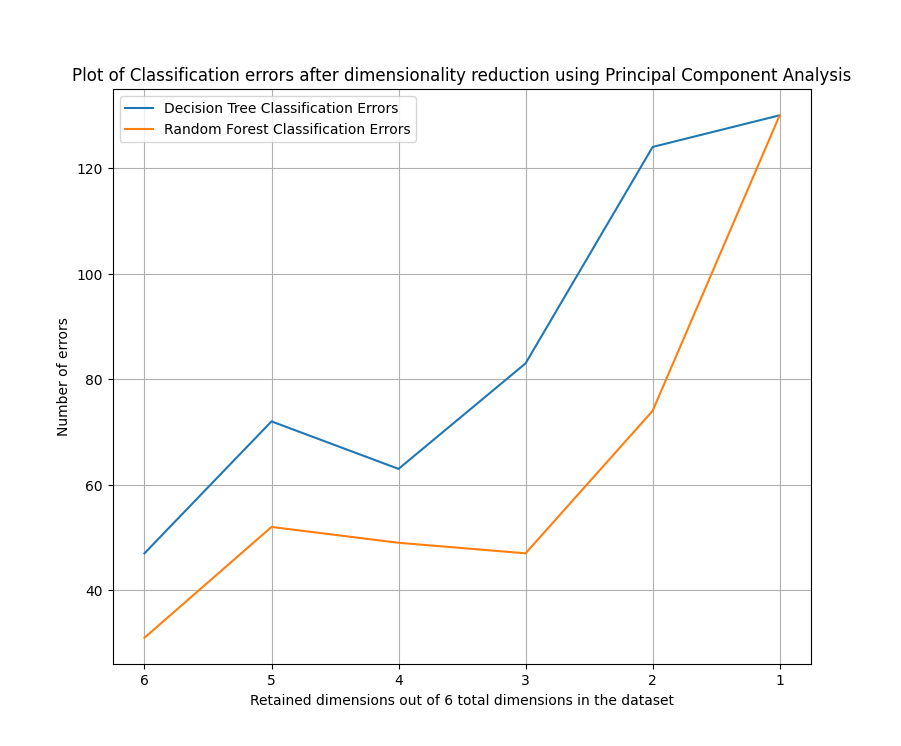
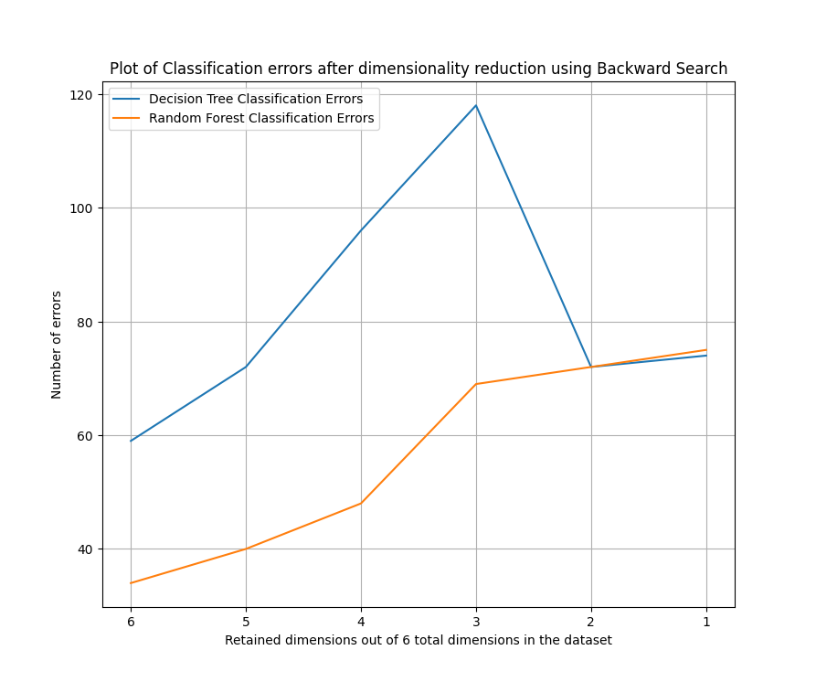
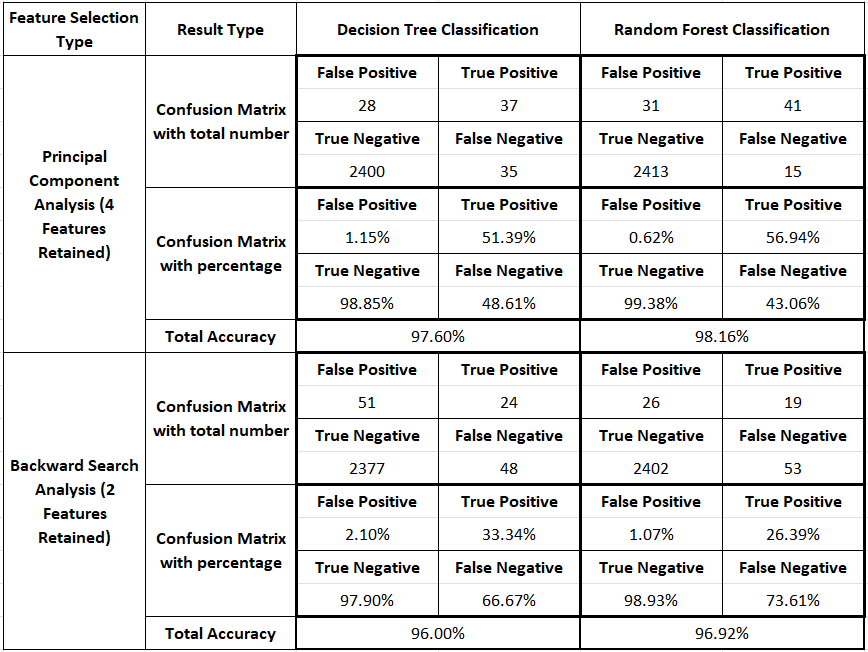

# Machine Maintenance Prediction Using Machine Learning
AI4I (Artificial intelligence for Industry) 2020 Predictive Maintenance using Decision Tree and Random Forest Supervised Machine Learning Classification algorithms. Principal Component Analysis and Backward Search Analysis Dimensionality Reduction techniques were compared for feature extraction.

<h1>About the dataset</h1>

* The dataset used for this project was the "AI4I 2020 Predictive Maintenance Dataset" [1]
* This dataset consists of several machine failures and what type of failure mode it experienced like tool wear failure, heat dissipation failure, power failure, overstrain failure, and random failure, in scenarios with given working conditions such as Air temperature, Process Temperature, Rotational Speed, Torque, and Tool Wear.
* <b>Note: Dataset is a synthetic dataset that reflects real predictive maintenance data encountered in industry as close as possible since real predictive maintenance datasets are difficult to obtain.</b>
* Machine is marked as 1 (for failure) if at least one of the failure modes is marked as 1 (as failed).
  * Class A: Machine failed = 1
  * Class B: Machine did NOT fail = 0
* Failures modes were not considered in the training of the model. Only two classes were considered; machine fails or not fails depending on the working conditions.
* There are total of 14 features in this dataset which include Unique ID for each datapoint, Product ID, and 5 different types of machine failure modes. These features do not contribute to the classification to predict Class A or Class B, hence were removed.
* Product Quality Column:
  * Consists of L (low), M (medium), and H (high) variants
  * Variants were encoded to 0, 1, and 2 respectively using MS Excel
* After removing features, the dataset includes 7 features including machine failure labels (last column)
* The dataset was split into training and testing dataset using sklearn's "train_test_split" module.
  * Total number of datapoints = 10,000
  * Number of datapoints for Training (75%) = 7,500
  *Number of datapoints for Testing (25%) = 2,500

<h1>Principal Component Analysis Results</h1>

* PCA was done manually by calculating the eigenvalues and eigenvectors of the Covariance matrix of the training dataset.
* Dimensions were removed iteratively to retain 6, 5, 4, 3, 2, and 1 dimensions

* From Figure 2, we notice a sharp increase in classification errors for both Decision Tree Classification and Random Forest Classification when 3 or less dimensions are retained. The optimal number of dimensions seems to be 4.
* In Conclusion, 2 dimensions were selected, and DTC and RFC were performed for classifying Machine Failures and measure errors in a confusion matrix.

<h1>Backward Search Analysis</h1>

* Backward search analysis was performed manually to iterate through the training dataset and classifying after removing 1, 2, 3, 4, and 5 dimensions by searching for the dimension which leads to minimum classification error.

* From Figure 3, we notice that the errors drop significantly after removing 4 dimensions. The optimal number of dimensions from Backward Search Analysis is 2. 
* The code outputs the indices of the dimensions that were removed. From that we can find the 2 dimensions to be retained for minimum error. 
* Dimensions with indices 2 and 3 were retained, i.e., Process Temperature and Rotational Speed columns.
* DTC and RFC were performed for classifying Machine failures and measure errors in a confusion matrix.

<h1>Results</h1>

* The total accuracy of the models for both Principal Component Analysis and Backward Search Analysis is very close, i.e., around 97 ~ 98% and 96 ~ 97% respectively, but it was noted after running the codes several times, that the total accuracy of the models generated from Backward Search Analysis were always slightly lower than models generated from PCA.
* However, models generated using backward search only uses 2 dimensions, and still performs well.
* In Addition, Random Forest Classification has better accuracy compared to Decision Tree Classification for this dataset in both cases; PCA and Backward Search
* Looking at the confusion matrices, we notice that True Negative for all the 4 cases is in the range of 98 ~ 99%, but on the other hand, True Positive for all 4 cases are extremely low especially for models generated using Backward Search.
* True Positives for PCA models are around 51 ~ 57%, and True Positives for Backward Search Models are around 26 ~ 34%.
* This shows us that the models generated for all cases are extremely good at predicting when the machine does NOT fail but struggles at predicting when the machine fails.
* This could be because of the quality of the dataset. The dataset has 10,000 scenarios, and out of that, there are only 339 scenarios where the machine fails, which is only 3.39% of the dataset. This means the models generated using this dataset did not learn to predict the scenarios when a machine fails but learned well to predict when the machine does not fail.
* In conclusion, a better dataset is required with more balanced datapoints for machine failure and non-failure scenarios classification.

<h1>References</h1>
[1] Stephan Matzka, School of Engineering, "UC Irvine Machine Learning Repository," [Online]. Available: http://archive.ics.uci.edu/ml/datasets/AI4I+2020+Predictive+Maintenance+Dataset.
